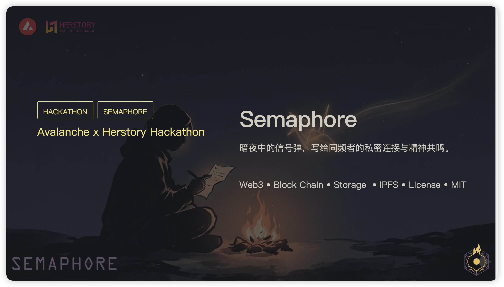
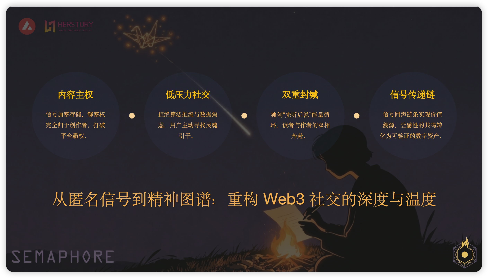

# Semaphore 🚩

> Web3-Based Private Resonance & On-Chain Spiritual Identity System

---

**🌍 Language / 语言**

[🇨🇳 中文](../README.md) | [🇺🇸 English (Current)](#)

---
## 🔗Link: [https://semaphore-omega.vercel.app/](https://semaphore-omega.vercel.app/)

---

## 📖 Table of Contents
- [💫 Vision](#1-vision)
- [🎯 Positioning](#2-positioning)
- [🔍 Why Web3](#3-core-pain-points--web3-solutions-why-web3)
- [✨ Core Innovations](#4-core-innovations)
- [🛠️ Tech Stack](#5-tech-stack)
- [⏩️ Current Status & Next Steps](#6-current-status--next-steps)

## 💫 Vision
In a noisy and over-financialized social era, Semaphore is committed to building a "safe haven" for like-minded people. Through decentralized technology, we protect privacy, ritual and spiritual resonance in social interactions, making every connection an eternal and pure "signal" on the blockchain.

---

## 🎯 Positioning
Semaphore refers to both the ancient "flag semaphore" and the well-known ZK (Zero-Knowledge Proof) protocol library in the Ethereum ecosystem.

This name precisely defines the soul of our product: at the technical bottom layer, the product inherits the hardcore spirit of "anonymous signal transmission" from the ZK protocol to achieve decentralized privacy protection; at the application surface layer, we reconstruct it into a ritualistic "spiritual semaphore" space.

It is not only a private social system, but also a "digital lighthouse" for finding like-minded resonance in the dark using native Web3 technologies such as Lit Protocol. It allows creators to send signals under full control of data sovereignty, to be seen, illuminated and connected by those who understand.

| Dimension | Traditional Social (X / Threads) | Creation Platform (Mirror / Medium) | Semaphore |
| --- | --- | --- | --- |
| **Core Driver** | Algorithm & Traffic | Content Assetization | **Spiritual Resonance** |
| **Privacy Level** | Platform Visible / Weak Privacy | Fully On-Chain Transparent | **Encrypted Authorized Access (Lit)** |
| **User Pressure** | High (Likes / Reposts) | Medium (Revenue Expectation) | **Very Low (Time-Limited / Private)** |
| **Relationship Attribute** | Weak Connection / Follower | Economic Interest Connection | **Deep Resonance / Spiritual Graph** |

---

## 🔍 Why Web3
### 1 Missing Social Sovereignty vs. Decentralized Storage
- Pain point: Traditional platforms control data, and private content can be deleted or censored at any time.
- Solution: Signal content is permanently stored via IPFS/Arweave. Decentralized access control is implemented using Lit Protocol. The "key" to content is entirely governed by on-chain conditions defined by creators (e.g., holding specific credentials), achieving true "content sovereignty".

### 2 Social Noise & Internal Competition vs. Low-Pressure Interaction Logic
- Pain point: Algorithm-driven traffic competition causes creative anxiety and high social pressure.
- Solution: No traffic-driven mechanism; adopts "signal matching". Smart contracts enable "time-limited reading", returning social interaction from "data competition" to "ritual connection".

---

## ✨ Core Innovations
### 1. Resonance Chain: On-Chain Spiritual Graph
Semaphore is not just isolated text, but a relationship network woven by resonance:
- Resonance Traceability: Each subsequent signal points to the preceding transaction hash, building a transparent "echo chain" on-chain.

### 2. Micro-Glow Economy Model
We have designed a non-intrusive incentive mechanism for quiet value flow:
- Star Dust: Readers can tip with micro-tokens (e.g., 0.01 AVAX), visually shown as a soft increase in signal brightness instead of cold numbers.
- Energy Conservation Mechanism: Posting a signal consumes "Energy"; the only way to obtain Energy is to "listen and respond" to others' signals. This forces the community to form a healthy cycle of "listen first, speak later".
- Automated Revenue Sharing: If a signal triggers a long transmission chain, subsequent Star Dust will be automatically distributed to every resonating participant in the chain via smart contracts.

---

## 🛠️ Tech Stack
- Network: Avalanche Fuji Testnet (Initial Deployment)
- Access Control: Lit Protocol (Threshold Encryption & Decryption)
- Storage: IPFS / Arweave
- Frontend: React + Vite (Tailwind CSS for Ambient Rendering)

---

## ⏩️ Current Status & Next Steps

### ✅ Completed
- [x] Core smart contract development and deployment to Avalanche Testnet
- [x] Frontend development of core pages
- [x] Implementation of core author-reader interaction functions

### 🔜 Next Steps
1. Introduce the **Star Dust** incentive system and refine on-chain resonance traceability logic.
2. Implement Soulbound Token (SBT) minting to record the unique "resonance coordinates" between creators and readers, forming a non-transferable, decentralized spiritual resume for users.
