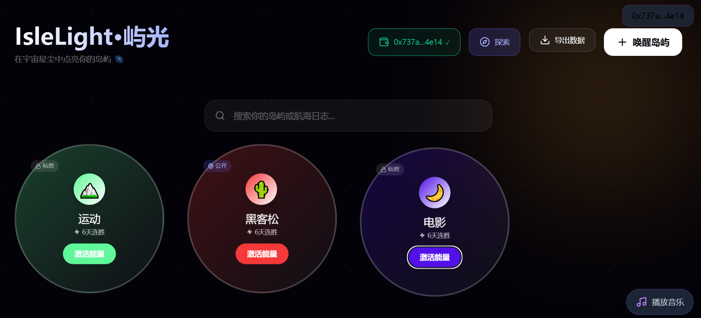

<div align="center">

# IsleLight

> Light up your habit lighthouse amid cosmic stardust — a decentralized habit-tracking DApp built on blockchain

[](https://opensource.org/licenses/MIT)
[](https://testnet.snowtrace.io/)
[](https://reactjs.org/)
[](https://soliditylang.org/)

---

**🌍 Language / 语言**

[🇨🇳 中文](../README.md) | [🇺🇸 English (Current)](#)

</div>

---
## Link: [https://semaphore-omega.vercel.app/](https://www-6-5-hackathon-sage.vercel.app/)



---

## Why IsleLight

Traditional habit-tracking apps suffer from a core issue: **your data doesn't belong to you**.

- Data stored on centralized servers can be lost at any time
- Platforms can modify or delete your records arbitrarily
- No way to prove the authenticity of your consistency
- Lack of community incentives and social recognition

**IsleLight** permanently anchors your habit records on the blockchain, creating tamper-proof, publicly verifiable "proof of habit". Every check-in is an on-chain signature, and every island is a footprint of your self-discipline in the Web3 world.

---

## Core Features

### ✅ Implemented

| Feature                                | Description                                                                     |
| -------------------------------------- | ------------------------------------------------------------------------------- |
| 🏝️**Habit Islands**            | Create personal habits with custom icons, colors, and goals                     |
| ⛓️**On-chain Proof**           | Public habit check-in records stored permanently on the blockchain              |
| 📝**Check-in Notes On-chain**    | Add notes during check-in that are permanently stored on-chain with records     |
| 🔗**Individual Record On-chain** | Option to upload specific check-in records to the chain for flexible management |
| 🎯**Streak Tracking**            | Visual display of your consistency journey and heatmap                          |
| 💭**Check-in Notes**             | Add thoughts and insights to each check-in                                      |
| 🌐**Explore Plaza**              | Discover public habit lighthouses from other users                              |
| 🔍**Enhanced Search**            | Supports fuzzy matching for usernames, habit names, and check-in content        |
| 📊**Search Index**               | Locally built search index with real-time result updates                        |
| 🎨**Hash Icons**                 | Generate unique, fixed visual identifiers based on habit names                  |
| 🔐**Identity System**            | Register a unique nickname on-chain to establish your Web3 identity             |
| 📊**Data Export**                | Export all data in JSON / CSV formats                                           |
| 🌙**Immersive UI**               | Cosmic starry sky theme with smooth interactive animations                      |

### 🚧 In Development

| Feature                          | Description                                        | Target Version |
| -------------------------------- | -------------------------------------------------- | -------------- |
| 🏆**Achievement Badges**   | Earn NFT badges for completing specific milestones | v0.3.0         |
| 📈**Statistics Dashboard** | Comprehensive visual dashboard for personal data   | v0.3.0         |

### 💡 Planned

| Feature                       | Description                                                                          |
| ----------------------------- | ------------------------------------------------------------------------------------ |
| 🎞️**Growth Posters**  | Generate monthly/yearly habit summary images for one-click sharing                   |
| 👥**Social Features**   | Follow, like, comment, and reminder functions                                        |
| 🏅**Incentive Economy** | Stake tokens to achieve goals; failed attempts distribute to successful participants |
| 📱**Mobile PWA**        | Native mobile app experience                                                         |
| 🔔**Smart Reminders**   | Configurable check-in reminder notifications                                         |
| 🤝**Habit Groups**      | Create or join habit communities for mutual supervision                              |

---

## Technical Architecture

```
┌─────────────────────────────────────────────────────────────┐
│                        Frontend Layer                        │
│  ┌─────────────┐  ┌─────────────┐  ┌─────────────────────┐  │
│  │  React 18   │  │  Tailwind   │  │   Framer Motion     │  │
│  │   + Vite    │  │    CSS      │  │   (Animations)      │  │
│  └─────────────┘  └─────────────┘  └─────────────────────┘  │
├─────────────────────────────────────────────────────────────┤
│                      Web3 Layer (wagmi)                      │
│  ┌─────────────────────┐  ┌─────────────────────────────┐   │
│  │   RainbowKit        │  │        ethers.js v5         │   │
│  │  (Wallet Connect)   │  │     (Contract Interaction)  │   │
│  └─────────────────────┘  └─────────────────────────────┘   │
├─────────────────────────────────────────────────────────────┤
│                    Smart Contract Layer                      │
│  ┌───────────────────────────────────────────────────────┐  │
│  │              IsleLight.sol (Solidity 0.8.19)          │  │
│  │  • Identity Management   • Lighthouse Registry        │  │
│  │  • Check-in Records      • Event Emissions            │  │
│  │  • Thought Storage       • Pagination Support         │  │
│  └───────────────────────────────────────────────────────┘  │
├─────────────────────────────────────────────────────────────┤
│                    Blockchain Network                        │
│  ┌───────────────────────────────────────────────────────┐  │
│  │              Avalanche Fuji Testnet                    │  │
│  │         (Chain ID: 43113, Free Gas Fees)               │  │
│  └───────────────────────────────────────────────────────┘  │
└─────────────────────────────────────────────────────────────┘
```

---

## Quick Start

### Prerequisites

- [Node.js](https://nodejs.org/) 18.0 or higher
- [npm](https://www.npmjs.com/) 9.0 or higher
- [MetaMask](https://metamask.io/) browser extension

### Installation

```bash
# Clone the repository
git clone https://github.com/your-username/islelight.git
cd islelight

# Install dependencies
npm install
```

### Configuration

1. **Add Avalanche Fuji Testnet to MetaMask**

   | Parameter       | Value                                      |
   | --------------- | ------------------------------------------ |
   | Network Name    | Avalanche Fuji Testnet                     |
   | RPC URL         | https://api.avax-test.network/ext/bc/C/rpc |
   | Chain ID        | 43113                                      |
   | Currency Symbol | AVAX                                       |
   | Block Explorer  | https://testnet.snowtrace.io               |
2. **Obtain Test Tokens**

   Visit the [Avalanche Fuji Faucet](https://faucet.avax.network/) to claim free test AVAX.
3. **(Optional) Configure WalletConnect Project ID**

   Edit `src/wagmi.js` and replace `projectId`:

   ```javascript
   const projectId = 'your-walletconnect-project-id';
   ```

   Get a free Project ID from [WalletConnect Cloud](https://cloud.walletconnect.com/).

### Running

```bash
# Start development server
npm run dev

# Visit http://localhost:5173
```

---

## User Guide

### Step 1: Connect Wallet

Click the **Connect Wallet** button in the top right corner and connect to the Avalanche Fuji Testnet using MetaMask.

### Step 2: Register Identity

When creating your first public habit, the system will prompt you to register an on-chain identity:

1. Enter your nickname (permanently recorded, cannot be modified)
2. Confirm the transaction
3. Identity creation successful

### Step 3: Create a Habit Island

Click the **Awaken Island** button:

| Field            | Description                                                                                |
| ---------------- | ------------------------------------------------------------------------------------------ |
| Island Name      | Name of the habit (e.g., "Daily Reading")                                                  |
| Guardian Element | Select an icon to represent your habit                                                     |
| Island Color     | Custom theme color                                                                         |
| Monthly Goal     | Set monthly check-in target (0 = unlimited)                                                |
| Visibility       | **Private**: Stored locally only `<br>`**Public**: Check-in records on-chain |

### Step 4: Check-in

Click the **Activate Energy** button on the habit card to complete check-in:

- Private habits: Check-in data stored in browser local storage
- Public habits: Option to upload check-in records to the chain for tamper-proof verification

### Step 5: Upload Check-in Notes On-chain

On the public habit details page, click the **Check-in On-chain** button:

1. Enter check-in notes in the popup (max 200 characters)
2. Click **Confirm On-chain**
3. Confirm the transaction in your wallet
4. Note content is permanently stored on the blockchain with the check-in record

### Step 6: Upload Individual Records On-chain

In the check-in record list of a public habit:

1. Locate the record to upload on-chain
2. Click the chain icon button 🔗 on the right side of the record
3. Confirm or edit the note content in the popup
4. Click **Confirm On-chain** to complete the transaction
5. Uploaded records will display an "On-chain" indicator

### Step 7: Explore & Search

Click the **Explore** button in the navigation bar:

1. **Browse Public Islands**: View all public habit lighthouses from users
2. **Search Function**:
   - Search usernames by keyword
   - Search habit names
   - Search check-in content
3. **Categorized Results**: Results displayed by user, check-in record, and island categories
4. **View Details**: Click cards to view user profiles and check-in history

---

## Smart Contract API

### Contract Information

| Parameter        | Value                                                                                         |
| ---------------- | --------------------------------------------------------------------------------------------- |
| Contract Address | `0x44011ffB344443f5bfA8264b5caf7852Cc139bEB`                                                |
| Network          | Avalanche Fuji Testnet                                                                        |
| Block Explorer   | [View Contract](https://testnet.snowtrace.io/address/0x44011ffB344443f5bfA8264b5caf7852Cc139bEB) |

### Core Methods

#### Identity Management

```solidity
// Create identity
function createIdentity(string memory _nickname) public

// Query identity
function getIdentity(address _user) public view returns (
    string memory nickname,
    uint256 joinTime,
    uint256 lighthouseCount
)

// Check if registered
function hasIdentity(address) public view returns (bool)
```

#### Lighthouse Management

```solidity
// Create lighthouse
function addLighthouse(string memory _contentHash, string memory _title) public

// Get all lighthouses
function getAllLighthouses() public view returns (Lighthouse[] memory)

// Get paginated lighthouses
function getLighthousesPaginated(uint256 _offset, uint256 _limit) public view returns (Lighthouse[] memory, uint256)

// Get user's lighthouses
function getUserLighthouses(address _user) public view returns (Lighthouse[] memory)
```

#### Check-in Management

```solidity
// Check-in (supports on-chain notes)
function checkIn(string memory _cid, string memory _thought) public

// Get user's check-in records
function getUserCheckIns(address _user) public view returns (CheckIn[] memory)

// Get paginated check-in records
function getUserCheckInsPaginated(address _user, uint256 _offset, uint256 _limit) public view returns (CheckIn[] memory, uint256)

// Get check-in count
function getCheckInCount(address _user) public view returns (uint256)
```

### Events

```solidity
event IdentityCreated(address indexed user, string nickname, uint256 joinTime);
event LighthouseAdded(address indexed user, string title, string contentHash, uint256 timestamp);
event CheckInAdded(address indexed user, string cid, string thought, uint256 timestamp);
```

### Data Structures

```solidity
struct Identity {
    string nickname;        // User nickname
    uint256 joinTime;       // Join timestamp
    uint256 lighthouseCount; // Number of created lighthouses
}

struct Lighthouse {
    string contentHash;     // Content hash (habit ID)
    string title;           // Habit name
    uint256 timestamp;      // Creation timestamp
    address author;         // Creator address
}

struct CheckIn {
    uint256 timestamp;      // Check-in timestamp
    string cid;             // Habit ID
    string thought;         // Check-in note (supports on-chain storage)
}
```

---

## Project Structure

```
islelight/
├── src/
│   ├── components/
│   │   ├── App.jsx            # Application entry component
│   │   ├── HabitDashboard.jsx # Main dashboard (habit management, check-in on-chain)
│   │   ├── ExplorePage.jsx    # Explore page (search index, fuzzy search)
│   │   └── HabitForm.jsx      # Habit form component
│   ├── config/
│   │   └── contract.js        # Contract address, ABI, search index configuration
│   ├── wagmi.js               # wagmi configuration
│   ├── main.jsx               # React entry point
│   └── index.css              # Global styles
├── index.html
├── package.json
├── vite.config.js
├── tailwind.config.js
└── README.md
```

---

## Development Guide

### Local Development

```bash
# Start development server (hot reload)
npm run dev

# Build production version
npm run build

# Preview production build
npm run preview
```

### Contract Deployment (Developers)

To deploy your own contract instance:

1. Install Hardhat

   ```bash
   npm install --save-dev hardhat @nomicfoundation/hardhat-toolbox
   ```
2. Initialize Hardhat project

   ```bash
   npx hardhat init
   ```
3. Copy `contracts/IsleLight.sol` to your Hardhat project
4. Configure `hardhat.config.js`

   ```javascript
   module.exports = {
     solidity: "0.8.19",
     networks: {
       fuji: {
         url: "https://api.avax-test.network/ext/bc/C/rpc",
         accounts: ["YOUR_PRIVATE_KEY"]
       }
     }
   };
   ```
5. Compile and deploy

   ```bash
   npx hardhat compile
   npx hardhat run scripts/deploy.js --network fuji
   ```
6. Update the contract address in `src/config/contract.js`

> **Note**: Testnet deployment is free but requires test tokens to pay for gas fees.

---

## Data Privacy

| Data Type                       | Storage Location     | Publicity                        |
| ------------------------------- | -------------------- | -------------------------------- |
| Private habit data              | Browser localStorage | Local only                       |
| Public habit metadata           | Blockchain           | Fully public, tamper-proof       |
| Check-in notes (public habits)  | Blockchain           | Fully public, permanently stored |
| Check-in notes (private habits) | Browser localStorage | Local only                       |
| Wallet address                  | Blockchain           | Public                           |
| User nickname                   | Blockchain           | Public, permanently unmodifiable |
| Search index                    | Browser localStorage | Local only                       |

---

## Technology Stack

| Category                       | Technology                      |
| ------------------------------ | ------------------------------- |
| **Frontend Framework**   | React 18 + Vite                 |
| **Styling Solution**     | Tailwind CSS + Inline CSS-in-JS |
| **Animation Effects**    | Framer Motion                   |
| **Web3 Connection**      | wagmi v2 + RainbowKit           |
| **Contract Interaction** | ethers.js v5                    |
| **Smart Contracts**      | Solidity 0.8.19                 |
| **Blockchain Network**   | Avalanche Fuji Testnet          |
| **Icon Library**         | Lucide React                    |

---

## Frequently Asked Questions

### Q: Why did my transaction fail?

**A:** Common reasons:

1. Attempting to create a public habit without registering an identity first
2. Insufficient wallet balance to pay for gas fees
3. Timeout due to network congestion

### Q: How to back up my data?

**A:** Click the **Export Data** button and select JSON or CSV format to download.

### Q: What's the difference between public and private habits?

**A:**

| Feature          | Private Habit                     | Public Habit        |
| ---------------- | --------------------------------- | ------------------- |
| Storage Location | Local browser                     | Blockchain          |
| Data Persistence | Lost when browser data is cleared | Permanently saved   |
| Verifiability    | None                              | Publicly verifiable |
| Discoverability  | No                                | Yes                 |
| Gas Fees         | None                              | Required            |

### Q: Can I modify check-in notes after they're on-chain?

**A:** No. The immutability of blockchain data means that once uploaded on-chain, note content is permanently saved and cannot be modified or deleted.

### Q: How does the search index work?

**A:** The Explore page fetches all public data from the blockchain, builds and caches a search index locally. The index refreshes automatically every hour, or you can click the "Refresh Data" button to update manually.

### Q: Do testnet tokens have real value?

**A:** No. Testnet tokens are for development and testing purposes only and have no real-world value.

---

## Contribution Guide

Contributions, issues, and feature requests are welcome!

1. Fork the repository
2. Create your feature branch (`git checkout -b feature/amazing-feature`)
3. Commit your changes (`git commit -m 'Add amazing feature'`)
4. Push to the branch (`git push origin feature/amazing-feature`)
5. Open a Pull Request

### Code Standards

- Use ESLint for code linting
- Use functional components + Hooks for React components
- Prefer Tailwind CSS for styling
- Update documentation for new features

---

## Roadmap

### v0.1.0 (Current)

- [X] Basic habit management
- [X] On-chain identity registration
- [X] Public habit on-chain storage
- [X] Explore page
- [X] Search functionality
- [X] Data export

### v0.2.0 (Implemented)

- [X] Check-in notes on-chain
- [X] Selective individual record on-chain upload
- [X] Enhanced search (supports usernames, check-in content)
- [X] Local caching of search index
- [X] Mobile experience optimization

### v0.3.0

- [ ] Achievement badge system
- [ ] Statistics data dashboard
- [ ] Social features (follow, like)

### v1.0.0

- [ ] Mainnet deployment
- [ ] Incentive economic model
- [ ] Mobile PWA

---

## License

This project is licensed under the MIT License - see the [LICENSE](LICENSE) file for details.

---

## Contact

- **Project Homepage**: [GitHub](https://github.com/your-username/islelight)
- **Issue Reporting**: [Issues](https://github.com/your-username/islelight/issues)
- **Block Explorer**: [Snowtrace](https://testnet.snowtrace.io/address/0x44011ffB344443f5bfA8264b5caf7852Cc139bEB)

---

<p align="center">
  <strong>Amid cosmic stardust, light up your own lighthouse 🌌</strong>
</p>
